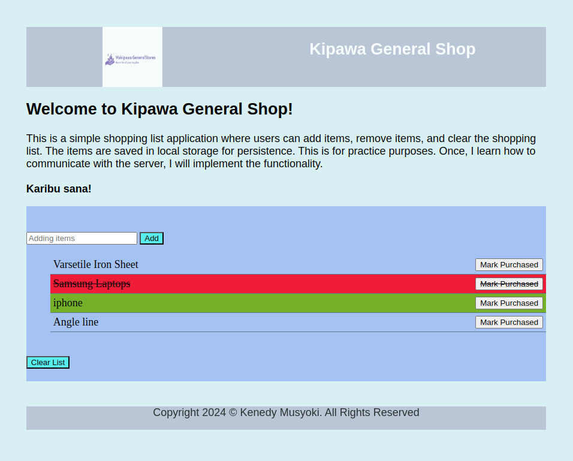

# Wk2 Code Challenge - Compulsory: Interactive Shopping List

## General comments aboute this Programs.

### 1. Preliquisites

    . To run this program, install the latest version of Node.js.

### 2. NOTE:

    This is static program; hence not linked to any database. It for practice purposes.

### 3. How to run any of these programs:

    - Ensure you have installed latest version of node.js.
    - Open your terminal and create files: <kipawaGenShop.html>, <kipawaGenShop.css>, and <kipawaGenShop.js
    - Copy the code respectively into your newly created files and launch the program by clicking the "goLive" button at the bottom of your Visual Studio.
    - Alternatively, git clone this repository <https://github.com/Kenedy4/ft10-c2> into your local machine and run it.
    - Enjoy the interaction and share your views through the comment section.

## Brief Description of the challenge

    This is a wwebpage with a shopping list. Users can add items to the list, mark items as purchased, and clear the list.

#### Project Requirements and more details

    A. Array:
    ==> Maintain a JavaScript array to store shopping list items.

    B. DOM Manipulation:
    ==> Create an HTML structure with an input field for adding items, a list container to display items, and buttons for "Add", "Mark Purchased", and "Clear List".
    ==> Use JavaScript to dynamically add new items to the list container when the user clicks the "Add" button. (The new items do not have to be persisted once the page refreshes)
    ==> Update the list item visually to indicate purchased items (e.g., strikethrough text, different background color).

    C. Event Handling:
    ==> Attach event listeners to the "Add" button to capture user input and add items to the list.
    ==> Attach event listeners to the list of items to allow users to mark them as purchased.
    ==> Attach an event listener to the "Clear List" button to remove all items from the list.

    D. Bonus Features:
    ==> Allow users to edit existing list items.
    ==> Implement persistence using local storage to save the list even after the page reloads.

## Purpose and Functionality.

    .This is a simple webapp that allows users to create a list of items.
    .They can add all items of their preferences to the list.
    .A customer can  a sitiple list of items.
    .A customer can can clear the ems from the list after enlisting them.
    .They can as well marke the item as purchase though the selected item will be struckthrough.
    .Unfortunately, this is a static-dynamic system that is but cannot store the data in the database,
    therefore it is a prototype feature of a system to be developed and deployed later.

## Application

    This program can be useful for small, medium and large businesses that want to venture in ebusiness of any calibre.

## Screenshots of the application

